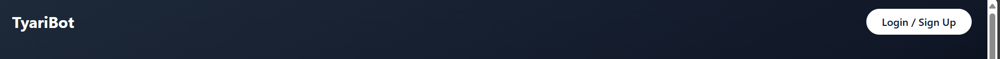
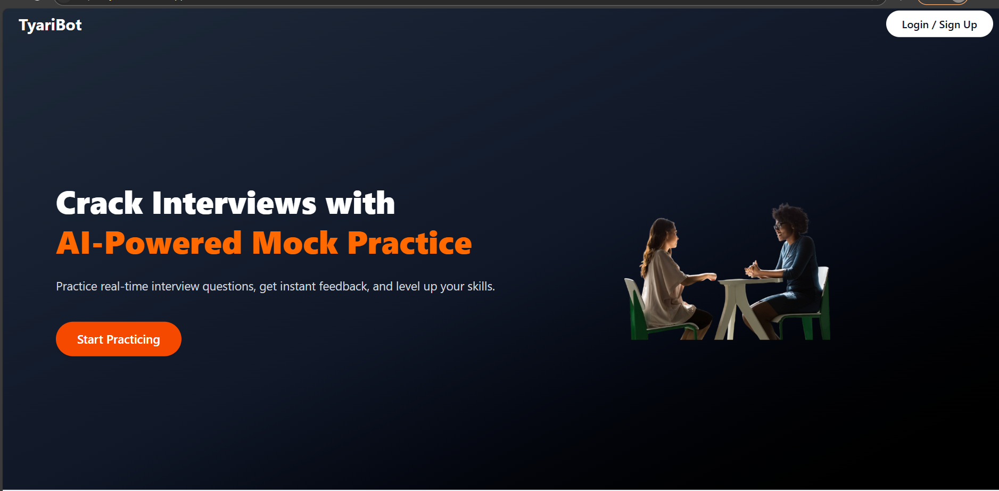

# 🤖 TyariBot – AI-Powered Mock Interview Platform

A full-stack intelligent mock interview simulator that helps users prepare for real-world technical interviews. Built using the MERN stack, JWT auth, and Gemini AI integration, TyariBot generates personalized interview questions and detailed explanations with code — just like a real interviewer would.

---

## 🌐 Live Demo

🔗 **Frontend**: [https://tyari-bot.vercel.app](https://tyari-bot.vercel.app)  
⚙️ **Backend**: [https://tyaribot.onrender.com](https://tyaribot.onrender.com)

---

## ✨ Features

- Secure user authentication using JWT
- Personalized session setup (Role, Experience, Topics)
- AI-powered question generation using Gemini API
- Detailed explanations and code via "Learn More"
- Session and question management with notes/pins
- Image upload support for user profiles
- Clean, modern responsive UI with Tailwind CSS
- Deployed: Vercel (Frontend) + Render (Backend)

---

## 🧠 Use Case

> _"I want to prepare for frontend interviews, but I’m overwhelmed by scattered topics."_  
> → **TyariBot** lets users define what they want to study, generates questions via Gemini AI, and guides them with clear answers — a personal AI mentor!

---

## 🔧 Tech Stack

| Layer          | Tech Stack                     |
| -------------- | ------------------------------ |
| Frontend       | React, Vite, Tailwind CSS      |
| Backend        | Node.js, Express.js            |
| AI Integration | Google Gemini Generative AI    |
| Authentication | JWT, bcryptjs                  |
| Database       | MongoDB Atlas                  |
| Deployment     | Vercel (FE), Render (BE)       |
| Utilities      | Multer (images), dotenv, axios |

---

## 🧭 Complete Workflow – From Landing Page to AI Output

### 1️⃣ Landing Page – First Impression

📍 **Route:** `/`  
🛠️ **Tech Used:** React + Tailwind CSS

- Clean and engaging interface
- Brief description of platform features
- “Get Started” CTA → navigates to login or registration

🖼️ _Screenshot Placeholder:_  

---

### 1️⃣ Landing Page – First Impression

📍 **Route:** `/`  
🛠️ **Tech Used:** React + Tailwind CSS

- Clean and engaging interface
- Brief description of platform features
- “Get Started” CTA → navigates to login or registration

🖼️ _Screenshot Placeholder:_  
`./screenshots/landing-page.png`

---

### 1️⃣ Landing Page – First Impression

📍 **Route:** `/`  
🛠️ **Tech Used:** React + Tailwind CSS

- Clean and engaging interface
- Brief description of platform features
- “Get Started” CTA → navigates to login or registration

🖼️ _Screenshot Placeholder:_  
`./screenshots/landing-page.png`

---

### 1️⃣ Landing Page – First Impression

📍 **Route:** `/`  
🛠️ **Tech Used:** React + Tailwind CSS

- Clean and engaging interface
- Brief description of platform features
- “Get Started” CTA → navigates to login or registration

🖼️ _Screenshot Placeholder:_  
`./Screenshots/lp.PNG`

---

### 1️⃣ Landing Page – First Impression

📍 **Route:** `/`  
🛠️ **Tech Used:** React + Tailwind CSS

- Clean and engaging interface
- Brief description of platform features
- “Get Started” CTA → navigates to login or registration

🖼️ _Screenshot Placeholder:_  
`./screenshots/landing-page.png`

---

### 1️⃣ Landing Page – First Impression

📍 **Route:** `/`  
🛠️ **Tech Used:** React + Tailwind CSS

- Clean and engaging interface
- Brief description of platform features
- “Get Started” CTA → navigates to login or registration

🖼️ _Screenshot Placeholder:_  
`./screenshots/landing-page.png`

---

### 1️⃣ Landing Page – First Impression

📍 **Route:** `/`  
🛠️ **Tech Used:** React + Tailwind CSS

- Clean and engaging interface
- Brief description of platform features
- “Get Started” CTA → navigates to login or registration

🖼️ _Screenshot Placeholder:_  
`./screenshots/landing-page.png`

---
