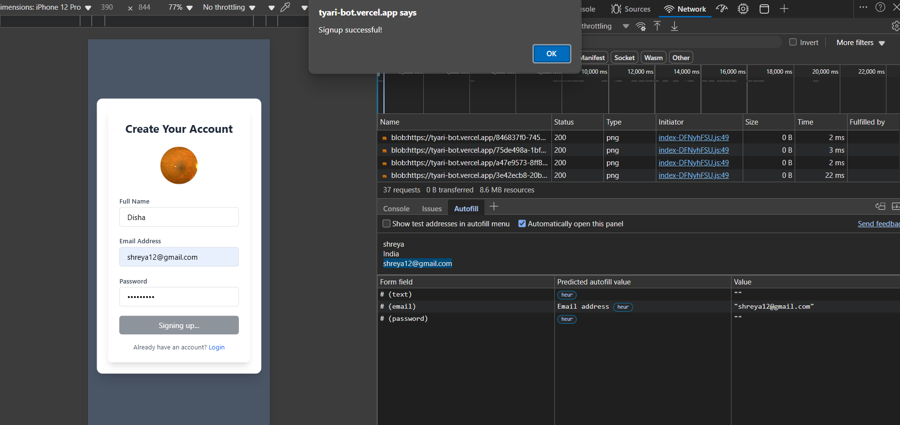
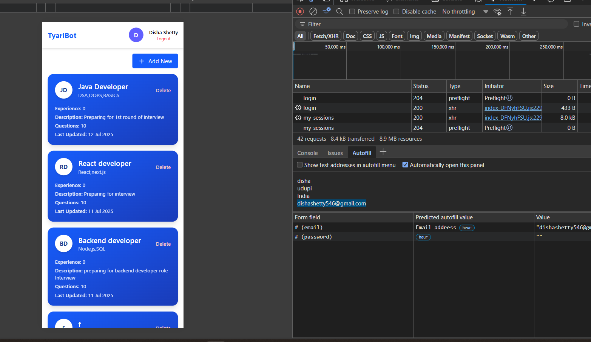
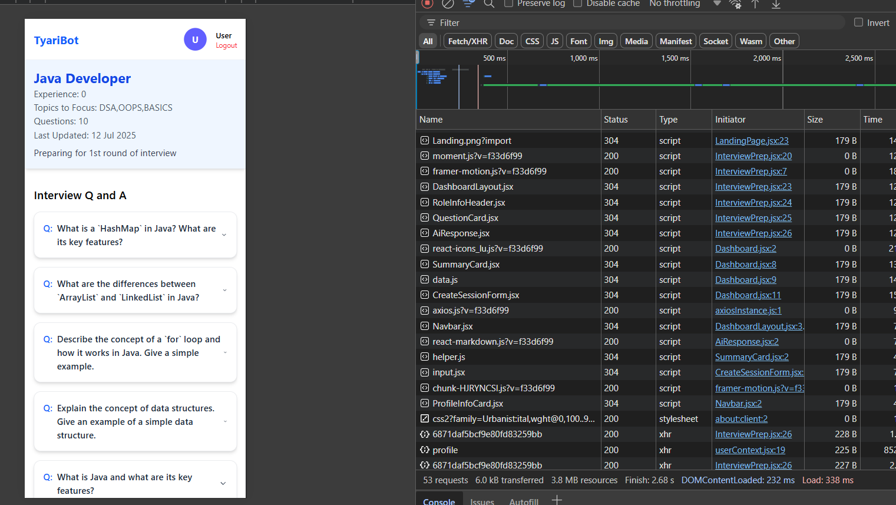
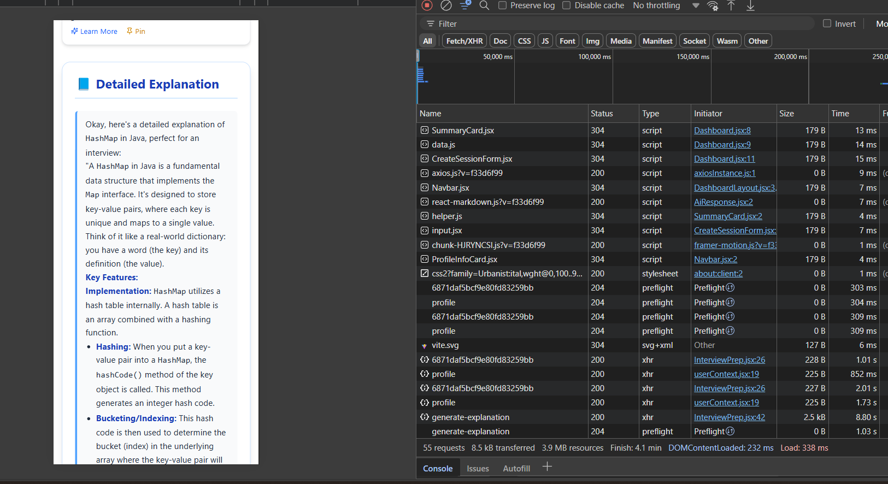
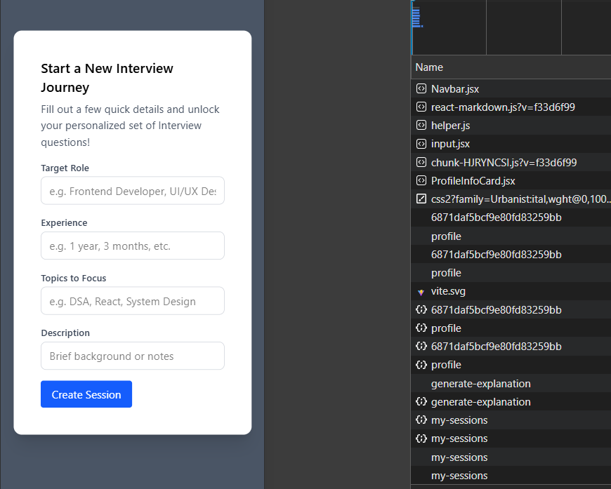
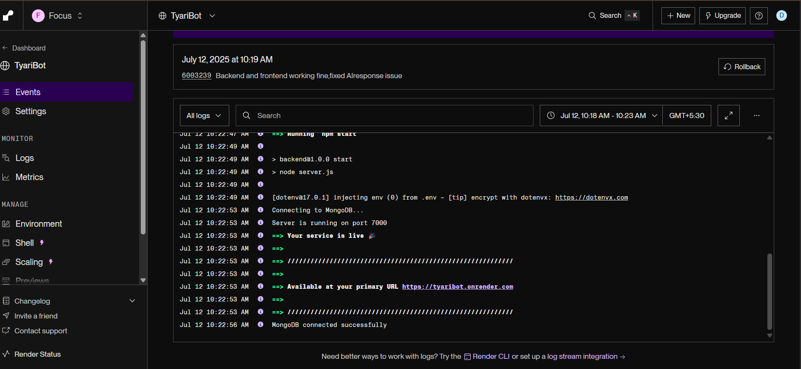

# 🤖 TyariBot – AI-Powered Mock Interview Platform


A full-stack intelligent mock interview simulator that helps users prepare for real-world technical interviews. Built using the MERN stack, JWT auth, and Gemini AI integration, TyariBot generates personalized interview questions and detailed explanations with code — just like a real interviewer would.

---

## 🌐 Live Demo

🔗 **Frontend**: [https://tyari-bot.vercel.app](https://tyari-bot.vercel.app)  
⚙️ **Backend**: [https://tyaribot.onrender.com](https://tyaribot.onrender.com)

---

## ✨ Features

- Secure user authentication using JWT
- Personalized session setup (Role, Experience, Topics)
- AI-powered question generation using Gemini API
- Detailed explanations and code via "Learn More"
- Session and question management with notes/pins
- Image upload support for user profiles
- Clean, modern responsive UI with Tailwind CSS
- Deployed: Vercel (Frontend) + Render (Backend)

---

## 🧠 Use Case

> _"I want to prepare for frontend interviews, but I’m overwhelmed by scattered topics."_  
> → **TyariBot** lets users define what they want to study, generates questions via Gemini AI, and guides them with clear answers — a personal AI mentor!

---

## 🔧 Tech Stack

| Layer          | Tech Stack                     |
| -------------- | ------------------------------ |
| Frontend       | React, Tailwind CSS            |
| Backend        | Node.js, Express.js            |
| AI Integration | Google Gemini Generative AI    |
| Authentication | JWT, bcryptjs                  |
| Database       | MongoDB Atlas                  |
| Deployment     | Vercel (FE), Render (BE)       |
| Testing API    | Postman                        |
| Utilities      | Multer (images), dotenv, axios |

---

## 🧭 Complete Workflow – From Landing Page to Deployment

### 1️⃣ Landing Page – First Impression

📍 **Route:** `/`  
🛠️ **Tech Used:** React + Tailwind CSS

- Clean and engaging interface
- Brief description of platform features
- “Get Started” CTA → navigates to login or registration

🖼️ _Screenshot Placeholder:_  


---

### 2️⃣ User Authentication (JWT Secured)

📍 **Routes:** `/login`, `/register`  
🛠️ **Tech Used:** React + Express + MongoDB + JWT

- Register with name, email, password
- Login returns a JWT token
- Token stored in `localStorage`
- Protected routes are secured using middleware

\🖼️ _Screenshot Placeholder:_  


---

### 3️⃣ Create Interview Session

📍 **Page:** `/dashboard`  
🛠️ **Tech Used:** React + Express + MongoDB

- Fill in role, experience, topics, and goal
- Submits session to backend and stores in database
- Used later for generating personalized AI questions
  \🖼️ _Screenshot Placeholder:_  
  

---

### 4️⃣ Generate Interview Questions (AI-Powered)

📍 **API:** `/api/ai/generate-questions`  
🛠️ **Tech Used:** Node.js + Express + Gemini API

- Sends session data to Gemini AI
- AI returns a tailored list of interview questions
- Questions are shown point-wise with clean UI

\🖼️ _Screenshot Placeholder:_  


---

### 5️⃣ View Answers + Learn More

📍 **API:** `/api/ai/generate-explanation`  
🛠️ **Tech Used:** Gemini API + Markdown Rendering

- Click on any question to view a short AI-generated answer
- Option to “Learn More” for detailed explanation with code
- Code shown in dark-themed blocks for better readability

\🖼️ _Screenshot Placeholder:_  


---

### 6️⃣ Session Management + Smooth UX

📍 **Page:** `/my-sessions`  
🛠️ **Tech Used:** React + REST API + JWT Auth + Tailwind CSS

- View all past sessions in a clean dashboard
- Pin key questions and add personal notes
- Collapsible question/answer views for better navigation
- Smooth and responsive user experience from start to end

\🖼️ _Screenshot Placeholder:_  


---

### 7️⃣ Deployment & Hosting

📍 **Deployment Setup:**

- 🚀 **Frontend:** Deployed on [Vercel](https://tyari-bot.vercel.app)
- 🛠️ **Backend:** Deployed on [Render](https://tyaribot.onrender.com)
- 💾 **Database:** Hosted on MongoDB Atlas

📦 **Environment Management:**

- All sensitive data (API keys, DB URIs, JWT secrets) managed securely using `.env` files
- `.env` variables are **not committed to version control** and safely configured on Vercel and Render dashboards
- CORS setup allows seamless communication between frontend and backend



### 📥 Clone the Repository

```bash
git clone https://github.com/Dishashetty546/TyariBot.git
cd TyariBot
```

### 🙌 Acknowledgements

- Google Gemini API – for AI-powered question generation
- MongoDB Atlas – for cloud database
- Render & Vercel – for deployment
- Open-source libraries
